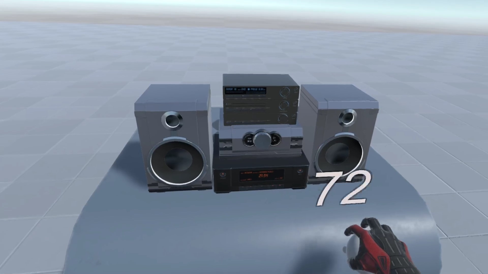

# OpenVR Volume Control

As of this writing, changing the volume from within VR involves pointing at a 2D volume control. I found that frustrating and difficult to do precisely, as I often wanted the volume at or near the lowest level, so this allows adjusting the volume by dragging a giant virtual slider with haptic feedback.

The audio gear on the table is from a paid asset package, and will not be included in this repository. The utility will still work if you don't have it - the gear is entirely cosmetic.

## Screenshots

## Credits

* [Hi-Fi mini components - PSR](https://assetstore.unity.com/packages/3d/props/electronics/hi-fi-mini-component-pack-110452)
* [Noble Savages by Jeris](http://dig.ccmixter.org/files/VJ_Memes/41913) (c) copyright 2013 Licensed under a Creative Commons Attribution Noncommercial  (3.0) license. Ft: NiGiD, Javolenus
